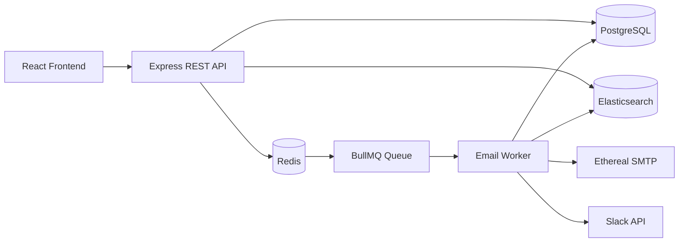

# Email Job Scheduler

A production-style, full-stack email scheduling system: users log in with Google, upload a
list of leads, and schedule bulk emails with a configurable send delay and hourly rate limit.
Scheduling is powered by **BullMQ delayed jobs backed by Redis** — there is no cron, no
`node-cron`, and no in-memory timers anywhere in this project.

---

## 1. Project Overview

The app lets an authenticated user:

1. Log in with Google.
2. Compose an email and upload a CSV/text file of recipient addresses.
3. Configure a start time, a delay between sends, and an hourly send limit.
4. Schedule the batch — each recipient becomes its own durable, delayed BullMQ job.
5. Watch jobs live in Bull Board.
6. View scheduled vs. sent/failed emails, and search them via Elasticsearch.
7. Connect Slack and get a real Slack message the moment an hourly limit is hit.

The system is designed to survive server restarts without losing or duplicating jobs, to rate
limit safely across multiple worker processes, and to never send the same email twice.

## 2. Architecture



- **PostgreSQL** is the source of truth for users, senders, emails, and Slack connections.
- **Redis** persists BullMQ queue/job state, and backs the distributed rate limiter and
  minimum-delay enforcement.
- **Elasticsearch** provides full-text search over emails; it is a secondary system — if it's
  down, sending still works and search falls back to Postgres `ILIKE`.
- **Bull Board** exposes a live view of waiting/delayed/active/completed/failed jobs.

OAuth flows:

```
Google:  Frontend -> GET /api/auth/google -> Google consent -> GET /api/auth/google/callback
         -> Passport creates/finds User in Postgres -> session cookie set -> redirect to /dashboard

Slack:   Dashboard "Connect Slack" -> GET /api/slack/connect -> Slack consent
         -> GET /api/slack/callback -> access token stored in slack_connections -> redirect to /dashboard
```

## 3. Technology Stack

**Backend:** TypeScript, Node.js, Express, PostgreSQL + Prisma, BullMQ, ioredis, Nodemailer
(Ethereal SMTP), `@elastic/elasticsearch`, Bull Board, Passport (Google OAuth 2.0), Slack Web
API (real OAuth v2, no mocking), Zod, Pino.

**Frontend:** React + TypeScript (Vite), Tailwind CSS, Axios, PapaParse (CSV parsing),
react-hot-toast, react-router-dom.

**Infrastructure:** Docker Compose for PostgreSQL, Redis, Elasticsearch.

## 4. Folder Structure

```
email-scheduler/
  docker-compose.yml
  README.md
  backend/
    prisma/schema.prisma
    src/
      config/        env, database (Prisma), redis, elasticsearch, passport
      controllers/    authController, emailController, slackController, systemController
      routes/         authRoutes, emailRoutes, slackRoutes, systemRoutes, index
      middleware/      auth, errorHandler, validate
      services/       emailService, rateLimitService, minDelayService, slackService,
                      elasticsearchService, idempotencyService, schedulingService
      repositories/   userRepository, senderRepository, emailRepository, slackRepository
      queues/         emailQueue.ts (BullMQ Queue definition)
      workers/        emailWorker.ts, workerProcess.ts (separate process entry point)
      utils/          logger, AppError, emailValidation, asyncHandler
      types/          shared TS types + Express/session augmentation
      app.ts, server.ts
    tests/            vitest unit tests
  frontend/
    src/
      components/     Header, ComposeEmailModal, ScheduledEmailsTable, SentEmailsTable,
                      SlackConnect, StatusBadge
      pages/          Login, Dashboard
      contexts/       AuthContext
      hooks/          useAuth
      services/       api.ts (single Axios layer)
      types/          shared frontend types
      utils/          csv.ts (CSV/text parsing + validation)
```

## 5. Prerequisites

- Node.js 20+
- Docker + Docker Compose
- A Google Cloud OAuth 2.0 client
- A Slack app with OAuth v2 configured
- A free Ethereal Email test account (https://ethereal.email)

## 6–9. Docker / PostgreSQL / Redis / Elasticsearch Setup

From the project root:

```bash
docker compose up -d
```

This starts:
- PostgreSQL on `localhost:5432` (db `email_scheduler`, user/pass `postgres`/`postgres`)
- Redis on `localhost:6379`
- Elasticsearch (single-node, security disabled for local dev) on `localhost:9200`

Wait ~30s for Elasticsearch to report healthy: `curl http://localhost:9200/_cluster/health`.

## 10. Ethereal Email Setup

1. Go to https://ethereal.email/create and generate a test account.
2. Copy the generated SMTP username/password into `backend/.env` as `ETHEREAL_USER` /
   `ETHEREAL_PASSWORD`.
3. Ethereal never delivers real mail — every send returns a **preview URL** (visible in server
   logs and in the "Preview" link on the Sent Emails table) where you can view the rendered
   email.

## 11. Google OAuth Setup

1. In Google Cloud Console, create an OAuth 2.0 Client ID (type: Web application).
2. Authorized redirect URI: `http://localhost:4000/api/auth/google/callback`.
3. Copy the Client ID/Secret into `backend/.env` as `GOOGLE_CLIENT_ID` / `GOOGLE_CLIENT_SECRET`.

## 12. Slack OAuth Setup

1. Create a Slack app at https://api.slack.com/apps ("From scratch").
2. Under **OAuth & Permissions**, add redirect URL: `http://localhost:4000/api/slack/callback`.
3. Add Bot Token Scopes: `chat:write`, `channels:read`.
4. Copy the Client ID/Secret into `backend/.env` as `SLACK_CLIENT_ID` / `SLACK_CLIENT_SECRET`.
5. Invite the app's bot user to a channel (or use its DM channel ID) — the demo stores whatever
   channel/user ID Slack returns from the OAuth response as the notification target.

## 13. Environment Variables

Copy the examples and fill in real values:

```bash
cp backend/.env.example backend/.env
cp frontend/.env.example frontend/.env
```

See `backend/.env.example` for the full list (database, Redis, Elasticsearch, Google, Slack,
Ethereal, worker concurrency, min delay, hourly limit, session secret, frontend/backend URLs).

## 14. Database Migration Instructions

```bash
cd backend
npm install
npx prisma migrate dev --name init
npm run prisma:generate
```

This creates the `users`, `senders`, `emails`, and `slack_connections` tables with the foreign
keys and indexes defined in `prisma/schema.prisma`.

## 15–17. Running the App

```bash
# Terminal 1 — infrastructure
docker compose up -d

# Terminal 2 — backend API
cd backend
npm install
npm run dev

# Terminal 3 — worker (separate process, as required for restart-safety)
cd backend
npm run worker

# Terminal 4 — frontend
cd frontend
npm install
npm run dev
```

Frontend: http://localhost:5173 — Backend API: http://localhost:4000/api

## 18. Bull Board

http://localhost:4000/admin/queues — protected with HTTP Basic Auth using
`BULL_BOARD_USER` / `BULL_BOARD_PASSWORD` from `backend/.env` (defaults: `admin` / `admin`).
Shows waiting, delayed, active, completed, and failed jobs live.

## 19. API Documentation

**Auth**
- `GET /api/auth/google` — start Google OAuth
- `GET /api/auth/google/callback` — Google redirects here
- `GET /api/auth/me` — current session user (401 if not logged in)
- `POST /api/auth/logout` — destroy session

**Emails** (all require an authenticated session)
- `POST /api/emails/schedule` — body: `{ subject, body, startTime, delayBetweenEmails,
  hourlyLimit, recipients[] }` → creates DB rows + delayed BullMQ jobs
- `GET /api/emails/scheduled?page=1` — paginated scheduled/processing emails
- `GET /api/emails/sent?page=1` — paginated sent/failed emails
- `GET /api/emails/search?q=john` — Elasticsearch-backed search (falls back to Postgres)
- `GET /api/emails/:id` — single email

**Slack**
- `GET /api/slack/connect` — redirects to Slack OAuth
- `GET /api/slack/callback` — Slack redirects here
- `GET /api/slack/status` — `{ connected, teamName }`
- `POST /api/slack/disconnect`

**System**
- `GET /api/health` — checks Postgres, Redis, Elasticsearch connectivity

## 20. Scheduling Architecture

`POST /api/emails/schedule` (see `schedulingService.ts`):

1. Validates and deduplicates recipient addresses.
2. Computes each recipient's `scheduledAt = startTime + index * delayBetweenEmails`.
3. Derives a **deterministic idempotency key** (`sha256(userId + recipient + subject +
   scheduledAtMs)`) per email.
4. Inserts one `emails` row per recipient (status `scheduled`), skipping any row whose
   idempotency key already exists.
5. Enqueues one **BullMQ delayed job per email**, using `delay = scheduledAt - now` and the
   idempotency key as the BullMQ job ID.

No cron, `node-cron`, `setInterval`, or OS scheduler is used anywhere — every "wait until time
X" is expressed as a single BullMQ delayed job.

## 21. Restart Persistence

BullMQ stores all job data (payload, delay, state) in Redis, not in the Node.js process memory.
When the API/worker process restarts:

1. Redis still holds every delayed job exactly as it was.
2. The Worker reconnects to the same Redis instance/queue name (`email-queue`) on boot.
3. BullMQ's internal scheduler (a Lua-script-driven mechanism inside Redis, not our own cron)
   resumes moving delayed jobs to the waiting state at their original due time.
4. Because the job ID equals the email's idempotency key, and the email's Postgres row still
   says `status = scheduled`, the worker can safely re-process it — nothing is lost or skipped.

**Demo:** schedule an email 2–3 minutes out, stop both `npm run dev` and `npm run worker`,
restart both, and watch the job still fire at the original time in Bull Board and the Sent
Emails table.

## 22. Idempotency / Duplicate Prevention

Three independent layers, documented in code:

1. **Deterministic idempotency key** — the same logical scheduling request always produces the
   same key, so retried API calls don't create duplicate DB rows or duplicate BullMQ jobs
   (`jobId` collisions are ignored).
2. **Atomic status transition** — `emailRepository.markProcessingIfScheduled()` runs a single
   `UPDATE ... WHERE status = 'scheduled'` statement. Only the execution that "wins" this
   compare-and-swap proceeds to send; a BullMQ stalled-job retry picking up the same logical
   job again will see 0 rows updated and stop.
3. **Final status check** — before doing any work, the worker checks `if (email.status ===
   'sent') return;` as a last line of defense.

## 23. Worker Concurrency

`WORKER_CONCURRENCY` (env var, default `5`) is passed straight into BullMQ's `Worker` options
and controls how many jobs a single worker process handles in parallel. It is never hardcoded.
You can also run multiple `npm run worker` processes for horizontal scaling — the rate limiter
and min-delay enforcement below are designed to stay correct under that scenario.

## 24. Minimum Delay Enforcement

`EMAIL_MIN_DELAY_MS` sets a system-wide floor; the user's requested
`delayBetweenEmails` is clamped to at least this value
(`Math.max(requested, EMAIL_MIN_DELAY_MS)`).

At send time, `minDelayService.checkAndReserve()` runs a single **Redis Lua script** that
atomically reads the sender's last-accepted-send timestamp, compares it against "now", and
either reserves the new timestamp (returns 0, proceed) or reports how long to wait (job is
deferred by re-enqueuing a new delayed job for that wait time). Because the whole
read-compare-write happens in one Lua script executed by Redis, it's safe even if many worker
processes evaluate it concurrently — no in-memory counters are involved.

## 25–26. Hourly Rate Limiting

`rateLimitService.tryReserveSlot(senderId, hourlyLimit)`:

- Key: `email-rate:{senderId}:{hourWindow}` where `hourWindow = floor(now / 3600000)` — an
  integer bucket per sender per clock hour.
- Uses a Redis `INCR` (atomic) wrapped in a small Lua script that also sets a TTL the first
  time the key is created, so old windows expire automatically.
- If the incremented count exceeds the limit, the increment is rolled back with `DECR` and the
  caller is told to wait until the next window.

**Behavior when the limit is hit:** the job is **not** failed or dropped. The worker resets the
email's DB row back to `scheduled` with a new `scheduledAt` at the start of the next hour
window, and re-enqueues a fresh delayed BullMQ job for that time. With 500 emails and a limit
of 100/hour, you'll see roughly 100 sent per rolling hour window until all 500 are delivered.

**Trade-off:** ordering across the deferred batch is only approximately preserved — jobs that
get deferred are re-inserted with a delay to "the next window," so if new jobs are scheduled in
the meantime they could interleave. For a hiring-assignment-scale system this is an acceptable
trade-off versus building a full priority-queue-per-sender.

Rate limiting is **per sender** (`Sender.id`), so `sender1` and `sender2` have fully independent
counters — see `Multiple Senders` below.

## Slack Notification Behavior

The moment `tryReserveSlot` reports `allowed: false`, the worker calls
`idempotencyService.claimRateLimitNotification(senderId, windowKey)`, which does a Redis
`SET key value NX EX 3700`. Only the first caller for that sender+hour "claims" the
notification and actually calls the real Slack `chat.postMessage` API
(`slackService.notifyRateLimitReached`) — every subsequent deferred job in the same hour is a
no-op here, so you get exactly one Slack message per rate-limit event, not one per deferred
email. If Slack isn't connected, this step is skipped entirely and logged — it never throws or
blocks sending.

## Elasticsearch Indexing / Search Strategy

- Postgres is the source of truth; Elasticsearch is a read-optimized search index.
- Every successful send calls `elasticsearchService.indexEmail()`, which upserts the email
  document (recipient, subject, body, status, timestamps) using the Postgres row's own UUID as
  the ES document ID, so re-indexing is idempotent.
- `GET /api/emails/search?q=` queries ES with a `bool` query (`term` on `userId`, `should`
  matches across recipient/subject/body). If ES is unreachable or returns no hits, the
  controller transparently falls back to a Postgres `ILIKE` search so the feature degrades
  gracefully rather than breaking.

## Handling 1000+ Jobs Scheduled at Once

- BullMQ jobs live in Redis, not in process memory, so queuing 1000+ delayed jobs is cheap and
  safe — Redis easily holds many thousands of small hashes.
- `WORKER_CONCURRENCY` bounds how many jobs actually execute in parallel at any moment.
- The hourly rate limiter guarantees no more than `hourlyLimit` sends succeed per sender per
  hour, regardless of how many jobs become "due" at once — excess jobs are deferred, not
  dropped or failed.
- Multiple worker processes can safely run concurrently against the same queue; BullMQ's
  built-in locking ensures each job is only actively processed by one worker at a time, and our
  Postgres compare-and-swap plus Redis atomic counters keep rate limiting and idempotency
  correct even under that concurrency.

## Multiple Senders

`Sender` is a first-class entity (`senders` table) with its own Ethereal credentials. Rate
limiting and minimum-delay keys are namespaced by `senderId`, so adding more senders to the UI
later requires no changes to the rate-limiting or scheduling logic — it already isolates state
per sender. The current UI provisions one default sender per user automatically
(`senderRepository.getOrCreateDefaultSender`) to keep the demo simple, per the assignment scope.

## Assumptions & Trade-offs

- One default sender is auto-created per Google-authenticated user (backed by the shared
  Ethereal credentials in `.env`); a full "connect your own sender" UI is out of scope here but
  the data model already supports it.
- Slack notifications target whatever channel/user ID Slack's OAuth response returns
  (`incoming_webhook.channel_id` or the authorizing user); a production app would let users
  pick a channel explicitly.
- Bull Board is protected with HTTP Basic Auth for local/demo purposes rather than being wired
  into the app's session-based auth.
- Deferred-job ordering during rate-limit backpressure is "best effort," not strictly FIFO
  (see trade-off note above).
- CSV parsing happens client-side with PapaParse; the backend independently re-validates every
  recipient address before scheduling, so a malicious/malformed upload can't reach the database
  unvalidated.

## 31–32. Testing

```bash
cd backend
npm test
```

Covers: email address validation/dedup, the hourly rate limiter's allow/reject + rollback
behavior, and the documented email status state machine (valid vs. invalid transitions). See
`backend/tests/*.test.ts`.

## Demo Instructions (End to End)

1. `docker compose up -d`, then run backend, worker, and frontend as above.
2. Open http://localhost:5173, click **Continue with Google**, complete real Google login.
3. On the dashboard, click **Connect Slack** and complete real Slack OAuth.
4. Click **Compose New Email**, fill subject/body, upload a CSV/text file of a few addresses.
5. Set **Start Time** a minute or two in the future, **Delay** to `2` seconds, **Hourly Limit**
   to `3` (to trigger rate limiting quickly), and click **Schedule**.
6. Open http://localhost:4000/admin/queues (Basic Auth `admin`/`admin`) and watch the delayed
   jobs count down.
7. Watch the **Scheduled Emails** tab; as jobs fire, entries move to **Sent Emails** with a
   clickable Ethereal preview link.
8. Once the 4th email in the batch hits the hourly limit, check Slack — you'll get a real
   message, and that email's row will show a later scheduled time instead of failing.
9. **Restart test:** schedule one more email 2–3 minutes out, then `Ctrl+C` both the backend and
   worker terminals, restart them (`npm run dev` / `npm run worker`), and confirm the email
   still sends exactly once at its original time.
